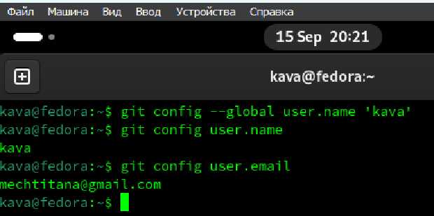
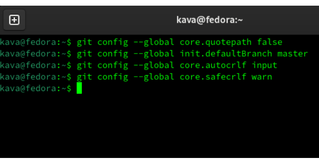
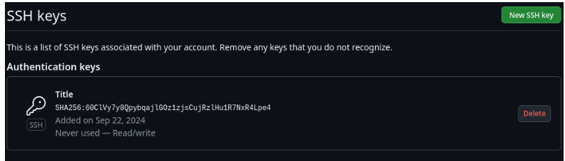
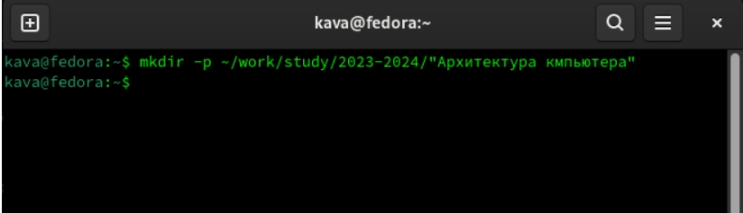
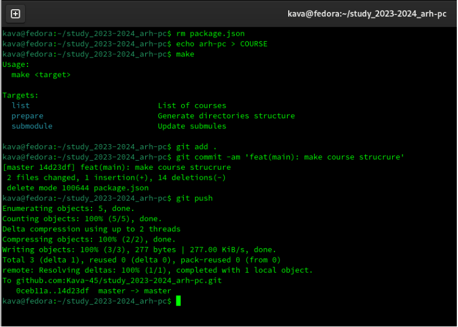

---
## Front matter
title: "Шаблон отчёта по лабораторной работе"
subtitle: "Простейший вариант"
author: "Дмитрий Сергеевич Кулябов"

## Generic otions
lang: ru-RU
toc-title: "Содержание"

## Bibliography
bibliography: bib/cite.bib
csl: pandoc/csl/gost-r-7-0-5-2008-numeric.csl

## Pdf output format
toc: true # Table of contents
toc-depth: 2
lof: true # List of figures
lot: true # List of tables
fontsize: 12pt
linestretch: 1.5
papersize: a4
documentclass: scrreprt
## I18n polyglossia
polyglossia-lang:
  name: russian
  options:
	- spelling=modern
	- babelshorthands=true
polyglossia-otherlangs:
  name: english
## I18n babel
babel-lang: russian
babel-otherlangs: english
## Fonts
mainfont: IBM Plex Serif
romanfont: IBM Plex Serif
sansfont: IBM Plex Sans
monofont: IBM Plex Mono
mathfont: STIX Two Math
mainfontoptions: Ligatures=Common,Ligatures=TeX,Scale=0.94
romanfontoptions: Ligatures=Common,Ligatures=TeX,Scale=0.94
sansfontoptions: Ligatures=Common,Ligatures=TeX,Scale=MatchLowercase,Scale=0.94
monofontoptions: Scale=MatchLowercase,Scale=0.94,FakeStretch=0.9
mathfontoptions:
## Biblatex
biblatex: true
biblio-style: "gost-numeric"
biblatexoptions:
  - parentracker=true
  - backend=biber
  - hyperref=auto
  - language=auto
  - autolang=other*
  - citestyle=gost-numeric
## Pandoc-crossref LaTeX customization
figureTitle: "Рис."
tableTitle: "Таблица"
listingTitle: "Листинг"
lofTitle: "Список иллюстраций"
lotTitle: "Список таблиц"
lolTitle: "Листинги"
## Misc options
indent: true
header-includes:
  - \usepackage{indentfirst}
  - \usepackage{float} # keep figures where there are in the text
  - \floatplacement{figure}{H} # keep figures where there are in the text
---

# Цель работы

Целью работы является изучить идеологию и применение средств
контроля версий. Приобрести практические навыки по работе с
системой git

# Выполнение лабораторной работы

1 Команда git config --global user.name дает возможность установить имя репозитория для всех моих репозиториев и команда git config --global user.email указываешь электронную почту для всех репозиториев для этого пользователя

{#fig:001 width=70%}

2 Команда git config --global core.quotepath настраивает utf-8  в выводе сообщений git
3 Команда git config --global init.defaultBranch дает возможность создать новую ветку репозитория
4 Команда git config --global core.autocrlf дает возможность Изменять настройки параметра в конфигурации git
5 Комана git config --global core.safecrlf дает возожность настраивать символы в окончании строки

{#fig:002 width=70%}

6 Команда ssh-keygen -C "Имя Фамилия " позволяет генерировать ключи приватные и открытые

{#fig:003 width=70%}

7 Я добавил ключ на github

{#fig:004 width=70%}

8 Я создал каталог Архитектура компьютера

{#fig:005 width=70%}

9 Я создал репозиторий курса

{#fig:006 width=70%}

10 Скопировал созданный репозиторий

{#fig:008 width=70%}

11 Я удалил файл package.json , создал каталог echo arh-pc >COURSE
{#fig:009 width=70%}

Задания для самостоятельной работы
1) Я создал отчет по выполнению лабораторной работы в
соответствующем каталоге
2) Я скопировал отчеты на выполнению предыдущей лабораторной
работы в соответствующий каталог
3) Я загрузил файлы на github
# Выводы

Я изучил и применил систему контроля версии Git применил
практические навыки системы Git.

# Список литературы{.unnumbered}

::: {#refs}
:::
