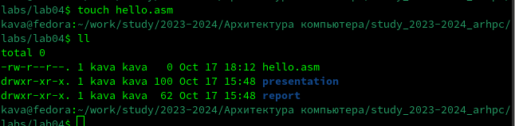
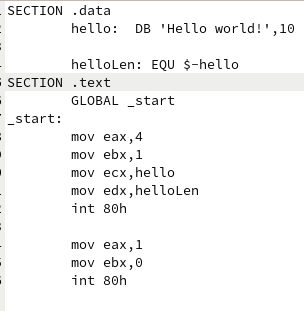
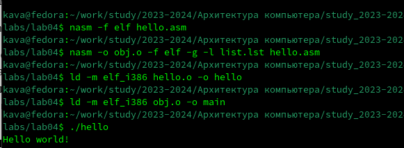
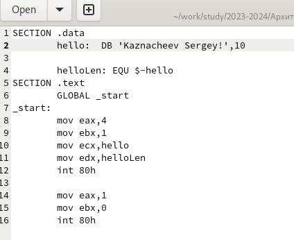
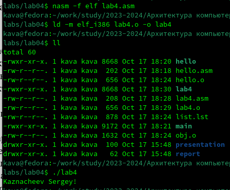

---
## Front matter
title: "Шаблон отчёта по лабораторной работе"
subtitle: "Простейший вариант"
author: "Дмитрий Сергеевич Кулябов"

## Generic otions
lang: ru-RU
toc-title: "Содержание"

## Bibliography
bibliography: bib/cite.bib
csl: pandoc/csl/gost-r-7-0-5-2008-numeric.csl

## Pdf output format
toc: true # Table of contents
toc-depth: 2
lof: true # List of figures
lot: true # List of tables
fontsize: 12pt
linestretch: 1.5
papersize: a4
documentclass: scrreprt
## I18n polyglossia
polyglossia-lang:
  name: russian
  options:
	- spelling=modern
	- babelshorthands=true
polyglossia-otherlangs:
  name: english
## I18n babel
babel-lang: russian
babel-otherlangs: english
## Fonts
mainfont: IBM Plex Serif
romanfont: IBM Plex Serif
sansfont: IBM Plex Sans
monofont: IBM Plex Mono
mathfont: STIX Two Math
mainfontoptions: Ligatures=Common,Ligatures=TeX,Scale=0.94
romanfontoptions: Ligatures=Common,Ligatures=TeX,Scale=0.94
sansfontoptions: Ligatures=Common,Ligatures=TeX,Scale=MatchLowercase,Scale=0.94
monofontoptions: Scale=MatchLowercase,Scale=0.94,FakeStretch=0.9
mathfontoptions:
## Biblatex
biblatex: true
biblio-style: "gost-numeric"
biblatexoptions:
  - parentracker=true
  - backend=biber
  - hyperref=auto
  - language=auto
  - autolang=other*
  - citestyle=gost-numeric
## Pandoc-crossref LaTeX customization
figureTitle: "Рис."
tableTitle: "Таблица"
listingTitle: "Листинг"
lofTitle: "Список иллюстраций"
lotTitle: "Список таблиц"
lolTitle: "Листинги"
## Misc options
indent: true
header-includes:
  - \usepackage{indentfirst}
  - \usepackage{float} # keep figures where there are in the text
  - \floatplacement{figure}{H} # keep figures where there are in the text
---

# Цель работы

Освоение процедуры компиляции и сборки программ, написанных на ассемблере NASM

# Теоретическое введение
Язык ассемблера (assembly language, сокращённо asm) — машинно-ориентированный язык низкого уровня. Можно считать, что он больше любых других языков приближен к архитектуре ЭВМ и её аппаратным возможностям, что позволяет получить к ним более полный доступ, нежели в языках высокого уровня, таких как C/C++, Perl, Python и пр. Заметим, что получить полный доступ к ресурсам компьютера в современных архитектурах нельзя, самым низким уровнем работы прикладной программы является обращение напрямую к ядру операционной системы. Именно на этом уровне и работают программы, написанные на ассемблере.Но в отличие от языков высокого уровня ассемблерная программа содержит только тот код, который ввёл программист.Таким образом язык ассемблера — это язык, с помощью которого понятным для человека образом пишутся команды для процессора.
# Выполнение лабораторной работы

1 Создал каталог lab04,перешел в него и создал файл hello.asm

{#fig:001 width=70%}

2  Открыл файл с помошью gedit и заполнил его
 
{#fig:002 width=70%}

3 Команда nasm -f elf hello.asm изпользуется для компиляции ассемблерского ,кода написанног на языке  ассемблера  NASM
4 Команда nasm -o obj.o -f elf -g -l list.lst hello.asm компилирует ассемблерский код из файла hello.asm в объект-файл obj.o в формате ELF
5 Команда ld -m elf_i386 hello.o -o hello передает обработку компоновщику 
6 Еще раз выполняю команду ld -m elf_i386 obj.o -o main для того чтобы получить исполняемый файл main
7 И с помощью команды ./hello вывожу Hello world

{#fig:004 width=70%}

Задание для самостоятельной работы

1 Я создал копию файла hello.asm  с именем lab04.asm с помощью команды cp

{#fig:005 width=70%}
2 Я внес изменения в файл с помощью текстого редактора, так чтобы вместо Hello world выводилась моя фамилия с именем
 
{#fig:006 width=70%}

3 Я Оттранслировал полученный текст программы lab4.asm в объектный файл и выполнил
компоновку объектного файла и запустил получившийся исполняемый файл
4 Вот ссылка на гитхаб
https://github.com/Kava-45/study_2023-2024_arhpc

# Выводы

Я освоил процедуры копиляции и сборки программ,написанных на ассемблере NASM

# Список литературы{.unnumbered}

::: {#refs}
:::
