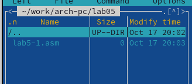
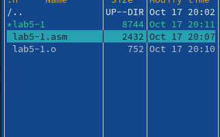

---
## Front matter
title: "Лабораторная работа №5"
subtitle: "Основы работы с Midnight Commander (mc). Структура программы на языке ассемблера NASM. Системные вызовы в ОС GNU Linux"
author: "Казначеев Сергей Ильич"

## Generic otions
lang: ru-RU
toc-title: "Содержание"

## Bibliography
bibliography: bib/cite.bib
csl: pandoc/csl/gost-r-7-0-5-2008-numeric.csl

## Pdf output format
toc: true # Table of contents
toc-depth: 2
lof: true # List of figures
lot: true # List of tables
fontsize: 12pt
linestretch: 1.5
papersize: a4
documentclass: scrreprt
## I18n polyglossia
polyglossia-lang:
  name: russian
  options:
	- spelling=modern
	- babelshorthands=true
polyglossia-otherlangs:
  name: english
## I18n babel
babel-lang: russian
babel-otherlangs: english
## Fonts
mainfont: IBM Plex Serif
romanfont: IBM Plex Serif
sansfont: IBM Plex Sans
monofont: IBM Plex Mono
mathfont: STIX Two Math
mainfontoptions: Ligatures=Common,Ligatures=TeX,Scale=0.94
romanfontoptions: Ligatures=Common,Ligatures=TeX,Scale=0.94
sansfontoptions: Ligatures=Common,Ligatures=TeX,Scale=MatchLowercase,Scale=0.94
monofontoptions: Scale=MatchLowercase,Scale=0.94,FakeStretch=0.9
mathfontoptions:
## Biblatex
biblatex: true
biblio-style: "gost-numeric"
biblatexoptions:
  - parentracker=true
  - backend=biber
  - hyperref=auto
  - language=auto
  - autolang=other*
  - citestyle=gost-numeric
## Pandoc-crossref LaTeX customization
figureTitle: "Рис."
tableTitle: "Таблица"
listingTitle: "Листинг"
lofTitle: "Список иллюстраций"
lotTitle: "Список таблиц"
lolTitle: "Листинги"
## Misc options
indent: true
header-includes:
  - \usepackage{indentfirst}
  - \usepackage{float} # keep figures where there are in the text
  - \floatplacement{figure}{H} # keep figures where there are in the text
---

# Цель работы
Приобретение практических навыков работы в Midnight Commander. Освоение инструкций
языка ассемблера mov и int.

# Выполнение лабораторной работы
1 Я открыл Midnight commander с помошью команды mc 

{#fig:001 width=70%}

С помощью стрелок и клавиши Enter я перехожу в каталог ~/work/arch-pc и создаю папку lab05

{#fig:002 width=70%}

Переходим в нее и созадем файл с помощью команды touch lab5-1.asm

{#fig:003 width=70%}

С помощью клавиши F4 откроем только что созданный файл
 
{#fig:004 width=70%}

Далее редактируем файл

{#fig:005 width=70%}

Теперь скомпилируем его 

{#fig:006 width=70%}

и соберем 
{#fig:007 width=70%}

проверяем что файлы создались и то что можно ввести ФИО

{#fig:008 width=70%}

{#fig:013 width=70%}

После скачиваем файл и копируем в рабочую папку 

{#fig:014 width=70%}

После я скопировал файлы и написал следующий код 

{#fig:015 width=70%}

Затем я создал исполняемый файл с помощью  nasm и id
 
{#fig:016 width=70%}

Далее поменяем команду sprintLF использовать просто команду sprint

{#fig:017 width=70%}

Точно также соберем файл и запустим его

{#fig:018 width=70%}

Задания для самостоятельной работы 

Создадим с помощью F6 копию файла lab5-1.asm

{#fig:019 width=70%}

Меняем файл так чтобы он выводил тот текст который получил на ввод 

{#fig:020 width=70%}

Сохраняем изменения и запускаем 

{#fig:021 width=70%}

Создаем файл с помощью F5 копию файла

{#fig:022 width=70%}

Опять создадим файл и проверим его на корректность работы 
{#fig:023 width=70%}

# Выводы
После выполнения лабораторной работы приобрел практические навыки работы Midnight Commander  и освоил инструкции языка ассемблера mov и int
# Список литературы{.unnumbered}

::: {#refs}
:::
