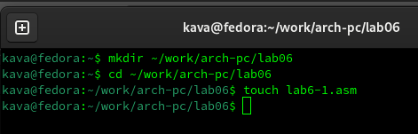
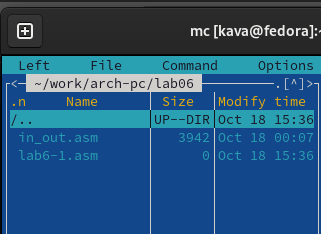
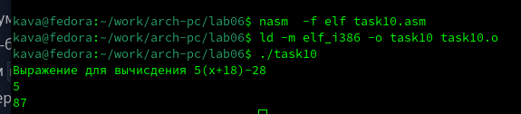

---
## Front matter
title: "Лабораторная работа №6."
subtitle: "Арифметические операции в NASM."
author: "Казначеев Сергей Ильич"

## Generic otions
lang: ru-RU
toc-title: "Содержание"

## Bibliography
bibliography: bib/cite.bib
csl: pandoc/csl/gost-r-7-0-5-2008-numeric.csl

## Pdf output format
toc: true # Table of contents
toc-depth: 2
lof: true # List of figures
lot: true # List of tables
fontsize: 12pt
linestretch: 1.5
papersize: a4
documentclass: scrreprt
## I18n polyglossia
polyglossia-lang:
  name: russian
  options:
	- spelling=modern
	- babelshorthands=true
polyglossia-otherlangs:
  name: english
## I18n babel
babel-lang: russian
babel-otherlangs: english
## Fonts
mainfont: IBM Plex Serif
romanfont: IBM Plex Serif
sansfont: IBM Plex Sans
monofont: IBM Plex Mono
mathfont: STIX Two Math
mainfontoptions: Ligatures=Common,Ligatures=TeX,Scale=0.94
romanfontoptions: Ligatures=Common,Ligatures=TeX,Scale=0.94
sansfontoptions: Ligatures=Common,Ligatures=TeX,Scale=MatchLowercase,Scale=0.94
monofontoptions: Scale=MatchLowercase,Scale=0.94,FakeStretch=0.9
mathfontoptions:
## Biblatex
biblatex: true
biblio-style: "gost-numeric"
biblatexoptions:
  - parentracker=true
  - backend=biber
  - hyperref=auto
  - language=auto
  - autolang=other*
  - citestyle=gost-numeric
## Pandoc-crossref LaTeX customization
figureTitle: "Рис."
tableTitle: "Таблица"
listingTitle: "Листинг"
lofTitle: "Список иллюстраций"
lotTitle: "Список таблиц"
lolTitle: "Листинги"
## Misc options
indent: true
header-includes:
  - \usepackage{indentfirst}
  - \usepackage{float} # keep figures where there are in the text
  - \floatplacement{figure}{H} # keep figures where there are in the text
---

# Цель работы
Освоение арифметических инструкций языка ассемблера NASM.
# Выполнение лабораторной работы
Для начала я создал папку с названием lab06 и файл  lab6-1.asm
{#fig:001 width=70%}
Далее заходим в папку и открываем только что созданный файл и вставляем код из листинга 6.1
{#fig:003 width=70%}
После чего копируем файл in_out.asm
{#fig:002 width=70%}
Теперь соберем наш файл и запустим его мы увидим что вывелось j а нам нужно вывести сумму 6 и 4, и чтобы вывелось число 10 
{#fig:004 width=70%}
Чтобы исправить это нам нужно убрать кавычки,теперь мы будет складывать числа,а не символы
{#fig:005 width=70%}
После исправлений запустим файл. Увидим, что ничего не вывелось. Это произошло из-за того, что мы выводим символы, а не число.
{#fig:006 width=70%}
Теперь создадим файл lab6-2.asm
{#fig:007 width=70%}
После вставим в него код из листинга 6.2
{#fig:008 width=70%}
Он выведет нам 106 это произойдет, так как у нас числа стоят в кавычках и мы складываем их коды (54+52=106)
{#fig:009 width=70%}
Теперь,если мы уберем кавычки то у нас выведется 10
{#fig:010 width=70%}
Теперь посмотрим в чем разница между iprintLF и iprint 
{#fig:011width=70%}
Собираем программу и запускаем 
{#fig:012 width=70%}
Мы увидим, что оперцая iprint не переносит на следующую строку 
Теперь создадим третий файл lab6-3
{#fig:013 width=70%}
И вставляем код из файла листинга 6.3
{#fig:014 width=70%}
Собираем программу и запускаем, и получаем верный результат 
{#fig:015 width=70%}
Теперь меняем файл так,чтобы мы могли посчитать значение выражения (4*6+2)/5
{#fig:016 width=70%}
Собираем программу и запускаем, и получаем верный результат 
{#fig:017 width=70%}
Теперь создами файл variat.asm
{#fig:018 width=70%}
И вставляем код из файла листинга 6.4
{#fig:019 width=70%}
Соберем и запустим ее
{#fig:020 width=70%}
И нам выведится число 14,и это действительно так
Ответим на вопросы лабораторной работы 
1 Какие строки листинга 6.4 отвечают за вывод на экран сообщения ‘Ваш вариант:’?
За это отвечает 21 строчка кода call sprint перед которой идёт строка mov eax,rem, которая перемещает строку с фразой в регистр eax ,из которого мы считаем данные для вывода 
2 Для чего используется следующие инструкции?
mov ecx, x
mov edx, 80
call sread

Эти инструкции используются для того, чтобы записать данные в переменную x
3 Для чего используется инструкция “call atoi”?
Для преобразования ASCII кода в число
4 Какие строки листинга 6.4 отвечают за вычисления варианта? 
div ebx
inc edx
Первая делит число x в регистре eax на значение ebx регистра  , а вторая прибавляет к значению регистра edx удиницу
5 В какой регистр записывается остаток от деления при выполнении инструкции “div ebx”?
В регистр edx
6 Для чего используется инструкция “inc edx”?
Для увеличения значения регистра edx на единицу
7 Какие строки листинга 6.4 отвечают за вывод на экран результата вычислений?
mov eax,edx
call iprintLF
Первая строка переносит значение  регистра edx в eax, а вторая вызывает операцию вывода значения регистра eax

Задание для самостоятельной работы
Я написал программу,которая вычисляет пример под номером 10
Предворительно, я создал файл под именем task10.asm и написал следующий код 
{#fig:021 width=70%}
И запустил код,в качестве x я указал число 5
{#fig:022 width=70%}
Как видим, программа работает исправна и правильно вычисляет выражения.
# Выводы
В результате выполнения лабораторной работы, я освоил арифметические операции которые есть в Ассемблере и как они работают.
Здесь кратко описываются итоги проделанной работы.

