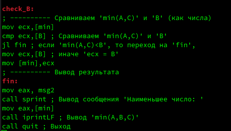

---
## Front matter
title: "Лабораторная работа №7"
subtitle: "Команды безусловного и условного переходов в Nasm. Программирование ветвлений."
author: "Казначеев Сергей Ильич"

## Generic otions
lang: ru-RU
toc-title: "Содержание"

## Bibliography
bibliography: bib/cite.bib
csl: pandoc/csl/gost-r-7-0-5-2008-numeric.csl

## Pdf output format
toc: true # Table of contents
toc-depth: 2
lof: true # List of figures
lot: true # List of tables
fontsize: 12pt
linestretch: 1.5
papersize: a4
documentclass: scrreprt
## I18n polyglossia
polyglossia-lang:
  name: russian
  options:
	- spelling=modern
	- babelshorthands=true
polyglossia-otherlangs:
  name: english
## I18n babel
babel-lang: russian
babel-otherlangs: english
## Fonts
mainfont: IBM Plex Serif
romanfont: IBM Plex Serif
sansfont: IBM Plex Sans
monofont: IBM Plex Mono
mathfont: STIX Two Math
mainfontoptions: Ligatures=Common,Ligatures=TeX,Scale=0.94
romanfontoptions: Ligatures=Common,Ligatures=TeX,Scale=0.94
sansfontoptions: Ligatures=Common,Ligatures=TeX,Scale=MatchLowercase,Scale=0.94
monofontoptions: Scale=MatchLowercase,Scale=0.94,FakeStretch=0.9
mathfontoptions:
## Biblatex
biblatex: true
biblio-style: "gost-numeric"
biblatexoptions:
  - parentracker=true
  - backend=biber
  - hyperref=auto
  - language=auto
  - autolang=other*
  - citestyle=gost-numeric
## Pandoc-crossref LaTeX customization
figureTitle: "Рис."
tableTitle: "Таблица"
listingTitle: "Листинг"
lofTitle: "Список иллюстраций"
lotTitle: "Список таблиц"
lolTitle: "Листинги"
## Misc options
indent: true
header-includes:
  - \usepackage{indentfirst}
  - \usepackage{float} # keep figures where there are in the text
  - \floatplacement{figure}{H} # keep figures where there are in the text
---
# Цель работы

Изучение команд условного и безусловного переходов. Приобретение навыков написания программ с использованием переходов. Знакомство с назначением и структурой файла листинга.

# Выполнение лабораторной работы
Создаем папку lab07 и файл lab7-1.asm.

После чего, запускаем  Midnight commander для удобства  и вставляем код в файл lab7-1.asm из файла листинга.

Теперь скопируем файл in_out.asm из рабочей директории прошлой лабораторной работы.

Теперь собираем программу и запускаем ее.

После чего, мы меням файл согласно листингу 7.2

Снова соберём программу и запустим ёё.

Теперь сделаем так, чтобы код выводил сообщения в обратном порядке (от 3 сообщения к первому). Для этого внесём в код следующие изменения.

Снова соберём программу и запустим ёё.

Теперь создаем файл  lab7-2.asm.

Запишем в него код из листинга 7.3 в файл lab7-2.asm.

И запустим его, предворительно собрав.

Теперь попробуем создать файл листинга при сборке файла lab7-2.asm

Теперь посмотрим, как выглядит файл листинга изнутри. Для этого откроем его в mcedit.

Вот наша программа.

Разберём несколько строк файла листинга:

1)Строка под номером 14 перемещает содержимое msg1 в регистр eax. Адрес указывается сразу после номера. Следом идёт машинный код, который представляет собой исходную ассемблированную строку в виде шестнадцатиричной системы. Далее идёт исходный код

2)15-ая строка отвечает за вызов функции sprint. Она также имеет адрес и машинный код

3)Строка 17 отвечает за запись переменной B в регистр ecx. Как видно, все строки имеют номер, адрес, машинный код и исходный код. 

Теперь пробуем допустить ошибку убрав у команды move 1 операнд.

Пробуем собрать файл с ошибками.

Теперь зайдем в файл листинг и посмотрим отображается ли в нём ошибка.

Как видим появилась ошибка 

# Выполнение заданий для самостоятельной работы 

Создадим файл для выполнения самостоятельной работы. Мой вариант-10

Напиши код для выполнения задания.

Соберем и запустим его.

Теперь создаем второй файл для второго задания.

И напишем следующий код.

Соберём и запустим этот файл.

Как видим программа всё посчитала правильно.

# Выводы
После выполнения лаборатоной работы. Я изучил команды условного и безусловного перехода. Приобрёл навыки написания программ с использованием переходов, познакомился с назначением и структурой файла листинга 

