---
## Front matter
title: "Лабораторная работа №9"
subtitle: "Понятие подпрограммы.Отладчик GDB."
author: "Казначеев Сергей Ильич"

## Generic otions
lang: ru-RU
toc-title: "Содержание"

## Bibliography
bibliography: bib/cite.bib
csl: pandoc/csl/gost-r-7-0-5-2008-numeric.csl

## Pdf output format
toc: true # Table of contents
toc-depth: 2
lof: true # List of figures
lot: true # List of tables
fontsize: 12pt
linestretch: 1.5
papersize: a4
documentclass: scrreprt
## I18n polyglossia
polyglossia-lang:
  name: russian
  options:
	- spelling=modern
	- babelshorthands=true
polyglossia-otherlangs:
  name: english
## I18n babel
babel-lang: russian
babel-otherlangs: english
## Fonts
mainfont: IBM Plex Serif
romanfont: IBM Plex Serif
sansfont: IBM Plex Sans
monofont: IBM Plex Mono
mathfont: STIX Two Math
mainfontoptions: Ligatures=Common,Ligatures=TeX,Scale=0.94
romanfontoptions: Ligatures=Common,Ligatures=TeX,Scale=0.94
sansfontoptions: Ligatures=Common,Ligatures=TeX,Scale=MatchLowercase,Scale=0.94
monofontoptions: Scale=MatchLowercase,Scale=0.94,FakeStretch=0.9
mathfontoptions:
## Biblatex
biblatex: true
biblio-style: "gost-numeric"
biblatexoptions:
  - parentracker=true
  - backend=biber
  - hyperref=auto
  - language=auto
  - autolang=other*
  - citestyle=gost-numeric
## Pandoc-crossref LaTeX customization
figureTitle: "Рис."
tableTitle: "Таблица"
listingTitle: "Листинг"
lofTitle: "Список иллюстраций"
lotTitle: "Список таблиц"
lolTitle: "Листинги"
## Misc options
indent: true
header-includes:
  - \usepackage{indentfirst}
  - \usepackage{float} # keep figures where there are in the text
  - \floatplacement{figure}{H} # keep figures where there are in the text
---

# Цель работы

Приобретение навыков написания программ с использованием подпрограмм. Знакомство с методами отладки при помощи GDB и его основными возможностями.

# Выполнение лабораторной работы

Для начала создадим папку и файл lab9-1.asm

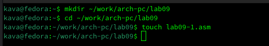

Далее, запустим Midnight commander и копируем файл in_out.asm.

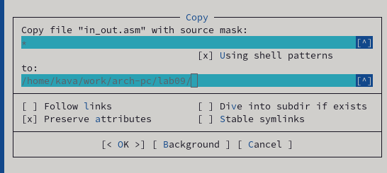

Вставляем в файл lab9-1.asm код из листинга 9.1

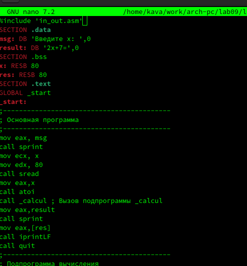

Собираем программу и проверяем её на корректность работы 

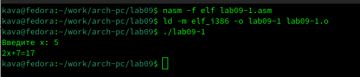

Теперь изменим файл так, чтобы внутри подпрограммы была ещё одна подпрограмма, вычисляющая значение g(x) и чтобы она передавала значение в первую подпрограмму, которая бы уже вычислила значение f(g(x))

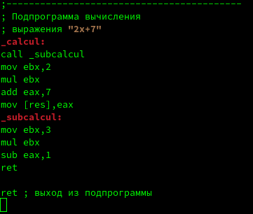

Собираем и проверяем

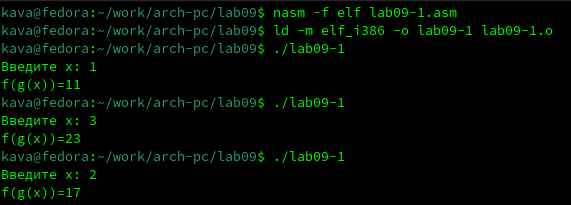

Создаем второй файл 

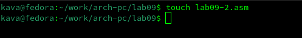

И вставляем код из листинга 9.2

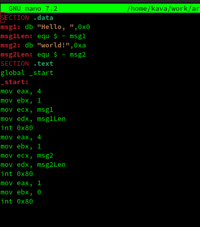

Соберем программу следующим образом

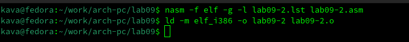

Теперь загружаем ее в gdb

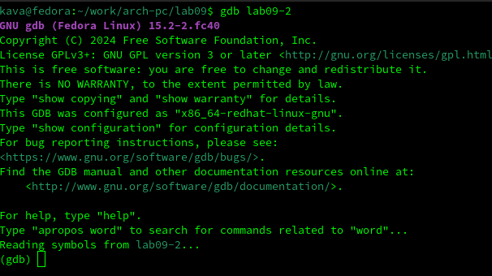

Запускаем ее с помощью команды run

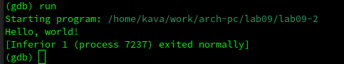

Создадим брейкпоинт на метке _start с помощью команды break 

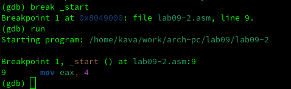

С помощью команды disassemble дизассемблируем её

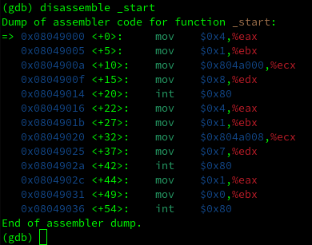

Переключаем вывода синтекса на intel

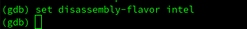

Повторяем команду disassemble

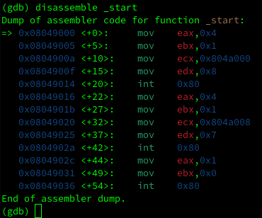

Включаем графическое отображение кода

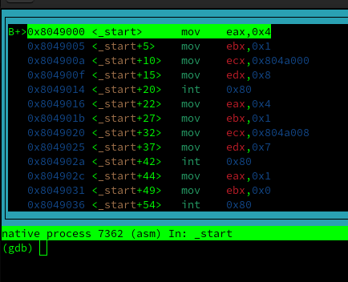

Теперь включаем графическое отображение значений регистров

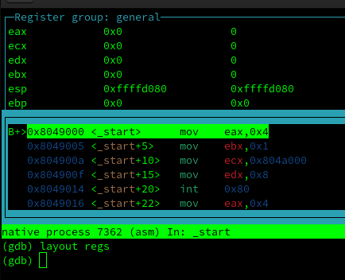

Выводим всю информацию о всех брейкпоинтах

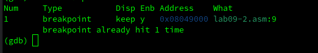

Создаем брейкпоинт по адресу 

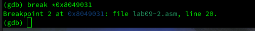

Выводим информацию 

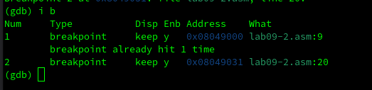

Теперь 5 раз выполняем команду si для построчного выполнения кода

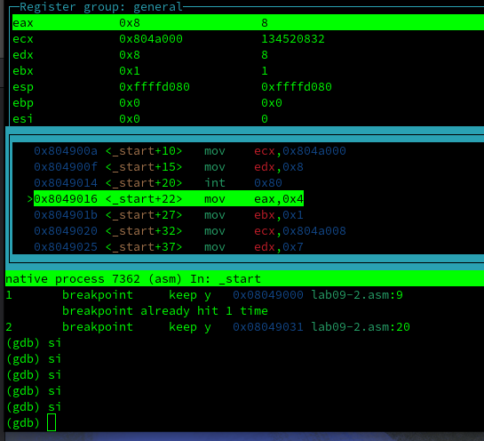

Как видим, поменялись значения регистров eax, ecx, edx и ebx. Теперь выведем информацию о значениях регистров

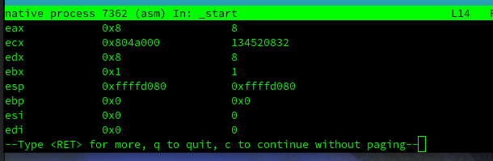

Выводим значения переменной по имени.

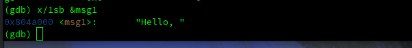

Теперь по адресу

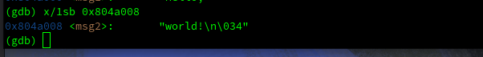

Теперь меняем первый символ 

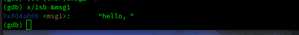

Меняем второй символ 

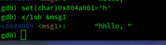

Меняем несколько символов второй переменной

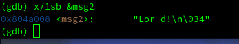

Выводим значения регистра  в строковом,двоичном и шестнадцатиричном виде 

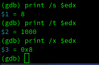

Пробуем изменить значения регистра 

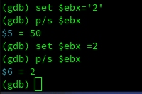

Мы увидим что в регистр записались разные значения, это связано с тем, что в одном случае мы записываем в него число, а в другом случае строчку. Завершаем программу с помощью  команды continue и выйдем.

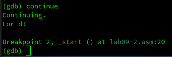

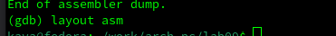

Копируем файл 

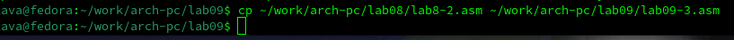

Соберём его и вгрузим в gdb

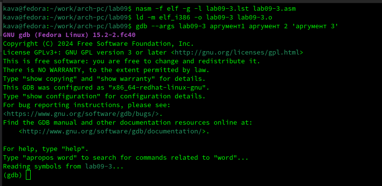

Создадим брейкпоинт и запустим программу 

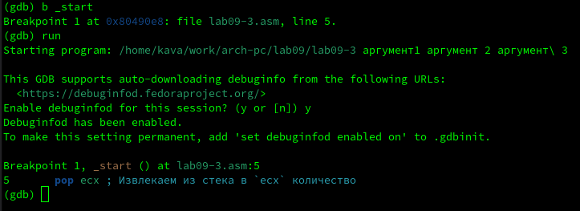

Выведем значение регистра esp, где хранятся данные о стеке

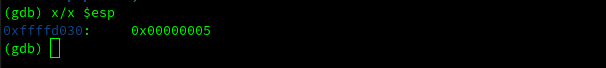

ВЫведем значения всех элементов стека 

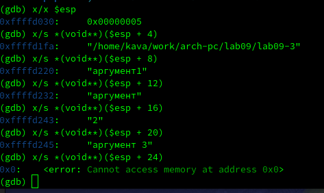

Как видим, для вывода каждого элемента стека нам нужно менять значение адреса с шагом 4. Это связано с тем, что именно с шагом 4 располагаются данные в стеке.

# Выполнение заданий для самостоятельной работы 

Копируем файл первого задания прошлой самостоятельной работы 

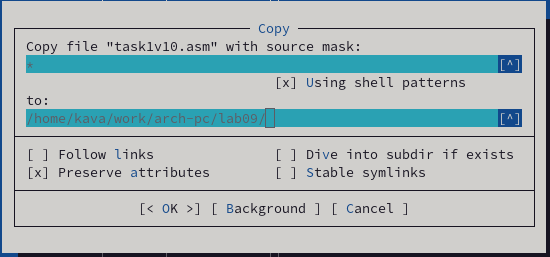

Переписываем так, чтобы он использовался для авчисления выражения подпрограммы

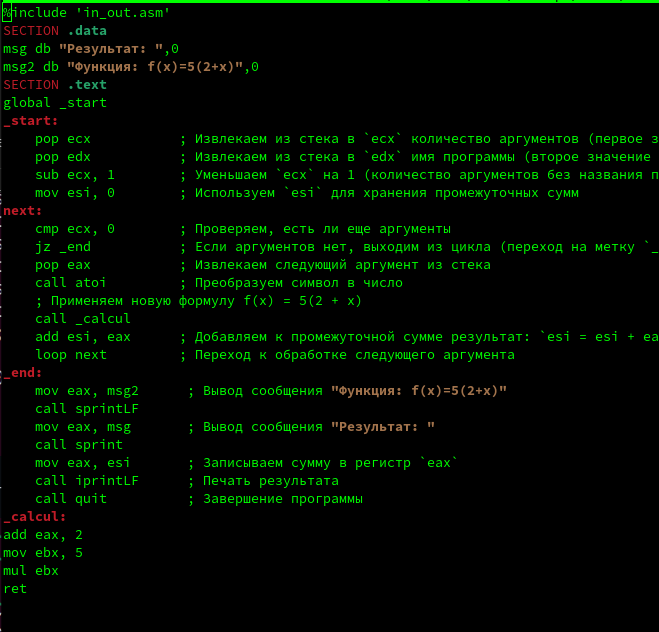

Собираем и проверяем на корректность выполнения.

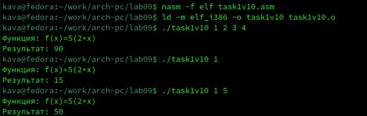

Создадим файл второго задания самостоятельной работы

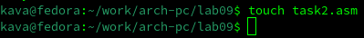

Далее вставляем код из листинга 9.3

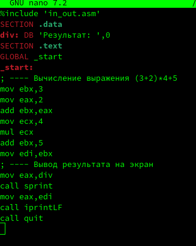

Собираем и запускуаем 

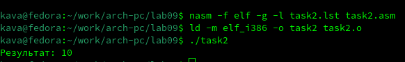

Как видим, код считает значение выражения неправильно. Загрузим его в gdb.

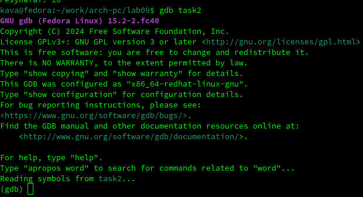

Включеним графическое отображение значений регистров и отображение графического отображения кода.

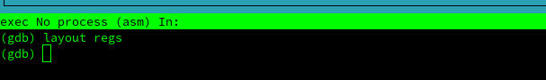

Устанавливаем брейкпоинт на _start 

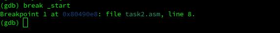

Запускаем и начинаем построчно выполнять код

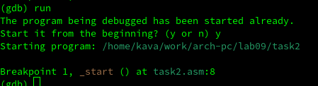

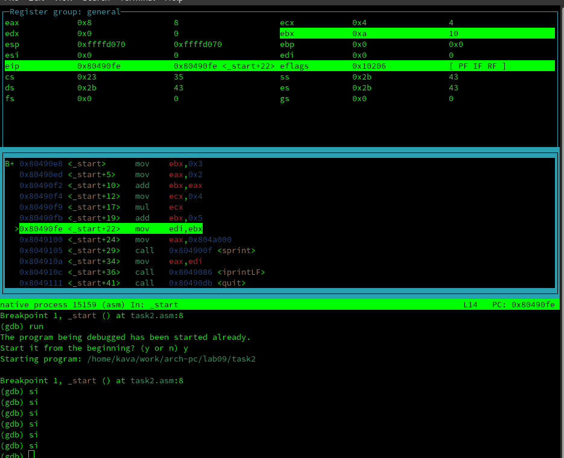

Как видим, мы должны были умножить значение регистра ebx, но умножили регистр eax. Нам необходимо все результаты хранить в регистре eax. Изменим код

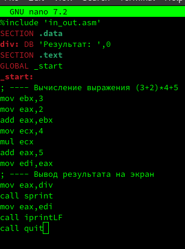

И проверяем на корректность выполнения.

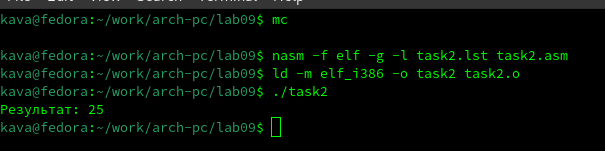

Как видим, теперь код работает корректно

# Выводы
После выполнения лабораторной работы. Я приобрел навыки программ с использованием подпрограмм и познакомился с методами отладки при помощи GDB и его основными возможностями 
