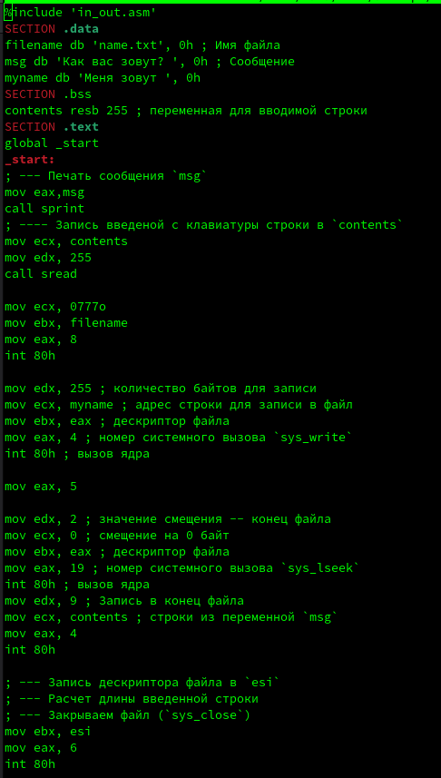

---
## Front matter
title: "Лабораторная работа №10"
subtitle: "Работа с файлами средствами Nasm"
author: "Казначеев Сергей Ильич"

## Generic otions
lang: ru-RU
toc-title: "Содержание"

## Bibliography
bibliography: bib/cite.bib
csl: pandoc/csl/gost-r-7-0-5-2008-numeric.csl

## Pdf output format
toc: true # Table of contents
toc-depth: 2
lof: true # List of figures
lot: true # List of tables
fontsize: 12pt
linestretch: 1.5
papersize: a4
documentclass: scrreprt
## I18n polyglossia
polyglossia-lang:
  name: russian
  options:
	- spelling=modern
	- babelshorthands=true
polyglossia-otherlangs:
  name: english
## I18n babel
babel-lang: russian
babel-otherlangs: english
## Fonts
mainfont: IBM Plex Serif
romanfont: IBM Plex Serif
sansfont: IBM Plex Sans
monofont: IBM Plex Mono
mathfont: STIX Two Math
mainfontoptions: Ligatures=Common,Ligatures=TeX,Scale=0.94
romanfontoptions: Ligatures=Common,Ligatures=TeX,Scale=0.94
sansfontoptions: Ligatures=Common,Ligatures=TeX,Scale=MatchLowercase,Scale=0.94
monofontoptions: Scale=MatchLowercase,Scale=0.94,FakeStretch=0.9
mathfontoptions:
## Biblatex
biblatex: true
biblio-style: "gost-numeric"
biblatexoptions:
  - parentracker=true
  - backend=biber
  - hyperref=auto
  - language=auto
  - autolang=other*
  - citestyle=gost-numeric
## Pandoc-crossref LaTeX customization
figureTitle: "Рис."
tableTitle: "Таблица"
listingTitle: "Листинг"
lofTitle: "Список иллюстраций"
lotTitle: "Список таблиц"
lolTitle: "Листинги"
## Misc options
indent: true
header-includes:
  - \usepackage{indentfirst}
  - \usepackage{float} # keep figures where there are in the text
  - \floatplacement{figure}{H} # keep figures where there are in the text
---

# Цель работы

Приобретение навыков написания программ для работы с файлами.

# Выполнение лабораторной работы

Создадим рабочую папку и файл lab10-1.asm, а также файлы readme-1.txt и readme-2.txt
 

Далее вставляем код из листинга 10.1 в файл lab10-1.asm

Скопируем файл in_out.asm 

Собираем программу и смотрим результат 

Мы видим,что файл выполнился, однако, ничего не произошло, так как в коде прописано записать данные в файл readme.txt, которого не существует. Теперь попробуем изменить права доступа для программы lab10-1 так, чтобы запретить всем группам пользователей запускать данную программу и попробуем запустить его

Мы увидим что файл не запустился и вывел ошибку. Теперь пробуем добавить файлу с исходным кодом lab10-1 права на запуск.

И нам выведет много ошибок так как файл сам по себе не предназначен для запуска ведь это файл с исходным кодом,который требует предварительный сборки. Теперь дадим выдадим права доступа для файлов readme-1.txt и readme-2.txt согласно варианту 10. Так,мы используем chmod и пишем права доступа в восьмиричном виде

Мы увидим, что права доступа установились корректно.

# Выполнение задания для самостоятельной работы 

Для начала создадим файл для самостоятельной работы 

Далее, напишем код согласно заданию к самостоятельной работе. Он должен создать файл name.txt, записать туда фразу "Меня зовут", запросить фамилию и имя пользователя,и дописать их в файл

 

Теперь собираем программу и проверяем корректность работы 

Далее проверяем создался ли файл с помощью команды ls

Затем проверим что записалось в файл 

И мы увидим, что программа работает корректно

# Выводы

В результате выполнения лабораторной работы. Я приобрел навыки написания программ для работы с файлами.

